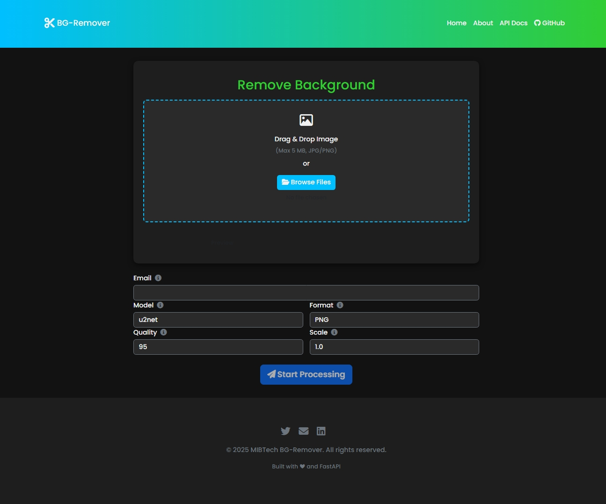

# Background Removal Service
<!-- add image screenshot -->



A simple FastAPI microservice to remove image backgrounds asynchronously.  
Clients upload an image and parameters, receive a `processing_id`, then poll status or download the result when ready.  

---

## Table of Contents

- [Quick Start](#quick-start)  
- [Environment Variables](#environment-variables)  
- [Installation & Run](#installation--run)  
- [Swagger UI](#swagger-ui)  
- [API Endpoints](#api-endpoints)  
  - [POST /process](#post-process)  
  - [GET /status/{processing_id}](#get-statusprocessing_id)  
  - [GET /download/{processing_id}](#get-downloadprocessing_id)  
- [Examples](#examples)  
  - [JavaScript (fetch)](#javascript-fetch)  
  - [TypeScript (axios)](#typescript-axios)  
  - [Python (requests)](#python-requests)  

---

## Quick Start

1. Copy `.env.example` → `.env` and fill in your credentials.  
2. `pip install -r requirements.txt`  
3. `uvicorn app.main:app --reload`  
4. POST an image to `/process`, poll `/status/{id}`, then GET `/download/{id}`.

---

## Environment Variables

Place in `.env` at project root:

```ini
# Redis
REDIS_URL=redis://localhost:6379/0

# SMTP (for notification emails)
SMTP_SERVER=smtp.example.com
SMTP_PORT=587
SMTP_USER=no-reply@example.com
SMTP_PASSWORD=supersecret

# App
BASE_URL=http://localhost:8000
OUTPUT_DIR=processed_images

# Scheduler
CLEANUP_INTERVAL_HOURS=1

# Model
GPU_ENABLED=false
MODEL_NAMES=u2net,u2netp,u2net_human_seg
```

---

## Installation & Run

```bash
git clone https://github.com/you/bg-removal-service.git
cd bg-removal-service

# create & activate virtualenv
python3 -m venv venv && source venv/bin/activate

pip install -r requirements.txt
uvicorn app.main:app --host 0.0.0.0 --port 8000 --reload
```

By default, the service listens on port **8000**.

---

## Swagger UI

Visit http://localhost:8000/docs for the interactive OpenAPI UI.

---

## API Endpoints

### POST /process

Asynchronously process an uploaded image.

- **URL**

  `/process`

- **Method**

  `POST`

- **Headers**

  `Content-Type: multipart/form-data`

- **Form fields**

  | Name          | Type    | Required | Description                              |
  |---------------|---------|----------|------------------------------------------|
  | `file`        | file    | yes      | Image file to process (jpg, png, etc.)   |
  | `email`       | string  | yes      | Your email for notification              |
  | `model`       | string  | no       | Removal model: `u2net` (default), `u2netp`, `u2net_human_seg` |
  | `output_format` | string| no       | `png` (default) or `jpg`/`jpeg`          |
  | `quality`     | int     | no       | JPEG quality (1–100), default `95`       |
  | `scale`       | number  | no       | Scale factor, default `1.0`              |

- **Response 202 Accepted**

  ```json
  {
    "processing_id": "3fa85f64-5717-4562-b3fc-2c963f66afa6",
    "status_url": "http://localhost:8000/status/3fa85f64-5717-4562-b3fc-2c963f66afa6",
    "message": "Processing started. Check your email when done."
  }
  ```

### GET /status/{processing_id}

Check the processing status.

- **URL**

  `/status/{processing_id}`

- **Method**

  `GET`

- **Path Parameters**

  | Name              | Type   | Description                       |
  |-------------------|--------|-----------------------------------|
  | `processing_id`   | string | UUID returned by `/process`       |

- **Response 200 OK**

  ```json
  {
    "processing_id": "3fa85f64-5717-4562-b3fc-2c963f66afa6",
    "status": "processing"
  }
  ```

  **Status** can be:
  - `processing`
  - `completed`
  - `failed`

- **Errors**

  - `404 Not Found` if the ID does not exist or expired.

### GET /download/{processing_id}

Download the completed image.

- **URL**

  `/download/{processing_id}`

- **Method**

  `GET`

- **Path Parameters**

  | Name            | Type   | Description                     |
  |-----------------|--------|---------------------------------|
  | `processing_id` | string | UUID of the completed process   |

- **Response 200 OK**

  Returns the image file as an attachment:

  ```
  Content-Disposition: attachment; filename="3fa85f64-5717-4562-b3fc-2c963f66afa6.png"
  ```

- **Errors**

  - `404 Not Found` if ID missing or expired.
  - `423 Locked` if still processing.

---

## Examples

### JavaScript (fetch)

```html
<!-- index.html -->
<input type="file" id="imgFile" />
<button id="upload">Upload</button>
<script>
  document.getElementById('upload').onclick = async () => {
    const fileInput = document.getElementById('imgFile');
    if (!fileInput.files.length) return alert('Select a file');

    const form = new FormData();
    form.append('file', fileInput.files[0]);
    form.append('email', 'you@example.com');
    form.append('model', 'u2net');
    form.append('output_format', 'png');
    form.append('quality', '90');
    form.append('scale', '1.0');

    // Start processing
    const res = await fetch('http://localhost:8000/process', {
      method: 'POST',
      body: form
    });
    const { processing_id, status_url } = await res.json();
    console.log(`ID: ${processing_id}`);

    // Poll status
    let status;
    do {
      await new Promise(r => setTimeout(r, 2000));
      const stRes = await fetch(status_url);
      const data = await stRes.json();
      status = data.status;
      console.log('Status:', status);
    } while (status === 'processing');

    // Download result
    if (status === 'completed') {
      window.location = `http://localhost:8000/download/${processing_id}`;
    } else {
      console.error('Processing failed');
    }
  };
</script>
```

### TypeScript (axios)

```ts
// client.ts
import axios from 'axios';

interface ProcessResponse {
  processing_id: string;
  status_url: string;
  message: string;
}

async function removeBackground(file: File) {
  const form = new FormData();
  form.append('file', file);
  form.append('email', 'you@example.com');
  form.append('model', 'u2net');
  form.append('output_format', 'png');
  form.append('quality', '95');
  form.append('scale', '1.0');

  // 1) submit
  const processRes = await axios.post<ProcessResponse>(
    'http://localhost:8000/process',
    form,
    { headers: { 'Content-Type': 'multipart/form-data' } }
  );
  const { processing_id, status_url } = processRes.data;

  // 2) poll
  let status = 'processing';
  while (status === 'processing') {
    await new Promise(res => setTimeout(res, 2000));
    const { data } = await axios.get<{ processing_id: string; status: string }>(
      status_url
    );
    status = data.status;
    console.log('Current status:', status);
  }

  // 3) download
  if (status === 'completed') {
    const downloadRes = await axios.get(
      `http://localhost:8000/download/${processing_id}`,
      { responseType: 'blob' }
    );
    // save file locally
    const url = URL.createObjectURL(downloadRes.data);
    const a = document.createElement('a');
    a.href = url;
    a.download = `${processing_id}.png`;
    a.click();
  } else {
    console.error('Failed to process image.');
  }
}
```

### Python (requests)

```py
import time
import requests

BASE = "http://localhost:8000"
# 1) Submit
with open("portrait.jpg", "rb") as f:
    files = {"file": ("portrait.jpg", f, "image/jpeg")}
    data = {
        "email": "you@example.com",
        "model": "u2net",
        "output_format": "png",
        "quality": 90,
        "scale": 1.0
    }
    r = requests.post(f"{BASE}/process", files=files, data=data)
    r.raise_for_status()
    info = r.json()
    pid = info["processing_id"]
    status_url = info["status_url"]
    print("Started:", pid)

# 2) Poll
while True:
    time.sleep(2)
    st = requests.get(status_url).json()["status"]
    print("Status:", st)
    if st != "processing":
        break

# 3) Download
if st == "completed":
    dl = requests.get(f"{BASE}/download/{pid}")
    dl.raise_for_status()
    with open(f"{pid}.png", "wb") as out:
        out.write(dl.content)
    print("Saved output:", f"{pid}.png")
else:
    print("Processing failed!")
```

---

**Enjoy your background‐free images!**  
